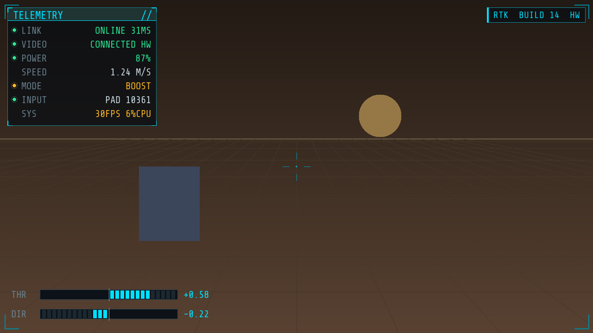

# TrimUI Teleop

Turn a **TrimUI Smart Pro** retro handheld into a low-latency **robot teleoperation
ground station** — live H.264 video on the screen with a technical overlay HUD, the
gamepad sticks driving the robot over UDP, telemetry coming back, and **zero network
config** (it finds the robot on the LAN by itself).



The handheld is a ~$80 Linux device with a 1280×720 screen, WiFi and a real gamepad —
a surprisingly good remote. This project makes the video path usable on its weak
Allwinner A133P by **hardware-decoding H.264 on the Cedar VPU** (with a clean **PyAV
software fallback**), and wraps it in a proper control UI. The robot side is a tiny
adapter, so the same handheld drives a **ROS 2** robot, a **Raspberry Pi** rover, a
**DonkeyCar**, or your own build — unchanged.

## Features

- **Zero-config networking** — robot advertises itself; handheld finds it (UDP discovery),
  remembers the IP for instant reconnect, and shows which platform it found.
- **Two switchable video decoders**, same UI: **hardware** (Cedar VPU, ~3% CPU, lowest
  latency) and **software** (PyAV, clean on fast motion). Toggle live from the menu.
- **Technical HUD** — telemetry panel, throttle/steering gauges, link/RTT, robot name,
  corner framing (Share Tech Mono).
- **In-app settings menu** — decoder, invert drive, deadzone, rescan; persisted, no file editing.
- **Two-way + safe** — gamepad → UDP @30 Hz; robot → telemetry; 0.5 s watchdog stops the robot on link loss.
- **Drive anything** — `RobotLink` makes a robot adapter ~15 lines; ships with ROS 2 / Pi GPIO / DonkeyCar examples.

## How it works

```
 ┌────────── TrimUI Smart Pro (Linux + WiFi + gamepad) ──────────┐
 │  hwdec_shmem (C, Cedar VPU)  ─┐                                │
 │            or                 ├─► /tmp/hwframe (RGB) ─► teleop │
 │  sw_decode.py (PyAV)        ─┘                         (pygame)│
 │  sticks ─► UDP ctrl @30Hz ─►╮          ╭─ UDP telemetry ◄──────│
 └─────────────────────────────┼──────────┼──────────────────────┘
            discovery (UDP) ◄───┼──────────┤   same WiFi
                                ▼          │
        robot adapter:  camera ─► H.264-over-TCP   (run h264_server.py)
                        motors ◄─ control + watchdog        (RobotLink)
                        sensors ─► telemetry
```

The decoder (HW or SW) writes RGB into a shared-memory ring (`/tmp/hwframe`); `teleop.py`
just blits it and draws the UI — so the two backends are interchangeable and the UI never changes.

## Repo layout

| Path | What |
|---|---|
| `src/teleop.py` | the app: HUD, gamepad→UDP, telemetry, discovery, decoder switching |
| `src/sw_decode.py` | software H.264 backend (PyAV → `/tmp/hwframe`) |
| `src/discovery.py`, `src/robot_link.py` | shared protocol: LAN discovery + robot-adapter helper |
| `src/controller.py`, `config.py`, `probe_controller.py` | gamepad mapping, config defaults, axis prober |
| `hwdecode/hwdec_shmem.c`, `build.sh`, `cedar/` | hardware backend (Cedar VPU) + cross-compile + vendored deps |
| `app/` | CrossMix launcher tile (`config.json`, `launch.sh`, icon) |
| `robot_sim/robot.py` | desktop robot **simulator** (no deps) |
| `robot_sim/h264_server.py` | camera → H.264-over-TCP video server |
| `integrations/` | robot-side adapters: `ros2_bridge.py`, `pi_gpio_bridge.py`, `donkeycar_part.py` |
| `tools/` | decode-quality diagnostic harness (see *Diagnostics*) |
| `docs/PROTOCOL.md` | the wire protocol + how to write a robot adapter |
| `docs/HWDECODE.md` | the Cedar hardware-decode investigation + integration notes |

## Quick start (desktop, no robot or handheld)

Dependencies are in `pyproject.toml` (managed with [uv](https://docs.astral.sh/uv/);
plain `pip` works too). The desktop demo also needs **ffmpeg** on `PATH`
(`brew install ffmpeg` / `apt install ffmpeg`).

```bash
uv run python robot_sim/robot.py                      # robot simulator (advertises itself)
uv run python robot_sim/h264_server.py 0 1280 720 30  # webcam → video (0 = cam index, or "test")
uv run python src/teleop.py                            # the ground station (a 1280x720 window)
```
The third command runs the **client itself on your desktop** — handy for UI work without the
handheld. It discovers the sim, shows the webcam, and a plugged-in gamepad drives the on-screen
robot. Off-device it opens a window and uses the current interpreter for the software decoder;
on the handheld it's fullscreen with the mali venv. The diagnostic harness in `tools/` needs
the extra: `uv sync --extra tools`.

## The robot side

A robot adapter does four things — answer discovery, receive control, run a watchdog,
send telemetry. `src/robot_link.py` does all of it; you provide a drive callback:

```python
from robot_link import RobotLink
def drive(fwd, turn, boost, estop): ...        # fwd/turn −1..1; estop → stop
RobotLink(name="my-robot", on_control=drive).run()
```
Plus a video source: run `robot_sim/h264_server.py` on the robot's camera. **Encode
single-slice** (it does) — multi-slice is the worst case for the Cedar decoder (see HWDECODE.md).

Ready-made adapters (all speak the same protocol — the handheld auto-detects which):

| platform | file | notes |
|---|---|---|
| Demo sim | `robot_sim/robot.py` | no deps; a Tk window with a driving robot |
| ROS 2 | `integrations/ros2_bridge.py` | `fwd/turn` → `/cmd_vel` Twist; battery/odom → telemetry (needs `rclpy`) |
| Raspberry Pi | `integrations/pi_gpio_bridge.py` | differential drive via `gpiozero` (L298N/TB6612…) |
| DonkeyCar | `integrations/donkeycar_part.py` | drop-in part; `fwd/turn` → throttle/steering; boost toggles recording |

See `docs/PROTOCOL.md` to write your own.

## Build the hardware decoder

```bash
# get the proprietary Cedar .so blobs off your own device once — see hwdecode/cedar/README.md
ZIG=$(command -v zig) ./hwdecode/build.sh      # -> hwdecode/build/hwdec_shmem
```
Needs [zig](https://ziglang.org) as the aarch64 cross compiler. The software backend needs no build.

## Deploy to the handheld

```bash
ADB=/path/to/adb ./deploy.sh        # pushes the app to a USB-connected TrimUI
```
Then launch **Teleop** from the Apps menu — it finds the robot automatically.

**One-time device setup** (the app runs from a venv at `/mnt/UDISK/rtvenv`, python3.11):
```bash
/mnt/UDISK/rtvenv/bin/python3.11 -m pip install pygame numpy av
```
⚠️ **Display gotcha:** pip's pygame ships a generic SDL2 whose only video driver on this
device is "offscreen" → blank screen. Replace the `libSDL2-2.0.so.0` bundled inside pygame
with the device's `/usr/trimui/lib/libSDL2-2.0.so.0` (which has the **mali** driver the
launcher uses via `SDL_VIDEODRIVER=mali`). `numpy`/`av` are only needed for the software
decoder; the hardware (Cedar) backend is a standalone C binary.

## Controls

| Input | Action |
|---|---|
| Either stick | drive (throttle / steering) |
| A | action (sent to the robot, e.g. stand / sit) |
| B | boost · L1 | e-stop |
| MENU | settings menu (decoder · invert drive · deadzone · rescan · resume · exit) |
| Select + Start | backup quit |

Indices vary per device — `python src/probe_controller.py` to map a different gamepad.

## Diagnostics

`tools/` holds the adb-driven harness used to diagnose the Cedar decode: a deterministic
moving H.264 source, atomic device-side frame capture, and an objective corruption metric
vs ffmpeg ground truth. Useful for testing any H.264 decode-quality change.

## Hardware

**TrimUI Smart Pro (TG5040)** — Allwinner A133P (quad Cortex-A53 + Mali), 1280×720,
running CrossMix-OS (Linux). Not Android, despite the adb bridge.

## License

MIT — see [LICENSE](LICENSE). Bundles Share Tech Mono (OFL) and Allwinner Cedar headers;
see [docs/NOTICE.md](docs/NOTICE.md).
